# Dot

> **An AI that lives on your Mac.** Not a tab. Not a chatbox. A tiny pixel creature in the corner of your screen who remembers you, notices things, answers on your phone when you walk away, and learns what you actually want.

<p align="center">
  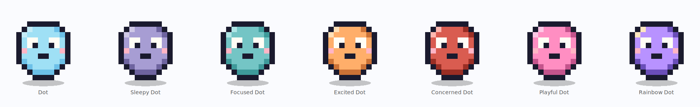
</p>

<p align="center">
  <a href="#install"></a>
  <a href="#install"></a>
  <a href="#what-you-can-do-on-day-one"></a>
  <a href="LICENSE"></a>
</p>

---

## Why Dot

You already have five LLMs open in five tabs. None of them know you, none of them remember yesterday, none of them are looking at your screen, and when you close your laptop they're gone.

**Dot is the opposite bet.**

- **She's always there.** A 128px pixel pet in the corner of your screen. Click her. Talk to her. She doesn't interrupt your flow.
- **She remembers.** Every conversation writes to her long-term memory. Tomorrow she still knows who you are and what you care about.
- **She notices.** Screen watcher, clipboard, active-app signal. She only speaks up when she has something worth saying — and only when you're away from the Mac.
- **She follows you.** Same Dot, same memory, on your phone over Telegram.
- **She can fix herself.** If you want her to behave differently, tell her. She'll rewrite her own code and run the change reversibly. Don't like it? `dot_undo`.
- **She runs when you sleep.** Headless launchd daemon mode means she's still there at 3am when the build fails.

She is not trying to be ChatGPT. She's trying to be the single helpful presence that knows you best, across every surface of your day.

## What you can do on day one

```
"onboard me"                      → 10-minute onboarding, she learns your rhythm
"what's on my calendar today?"    → reads Google Calendar locally
"summarise unread gmail"          → threads summarised in the bubble
"research 5 competitors to X"     → spawns 5 parallel workers, returns a brief
"turn off wifi"                   → handled, reversibly
"every weekday at 8am, brief me"  → a cron task she runs herself
"rewrite your heart to be warmer" → self-rewrite, reversible
"remind me via telegram when CI goes red" → presence-aware push
```

Every action is auditable. Every destructive action is undoable. Every scheduled job respects a daily spend cap.

---

## Meet the cast

Dot has seven character forms. She swaps between them based on context — or you can pin one.

<p align="center">
  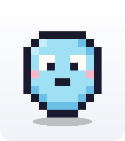
  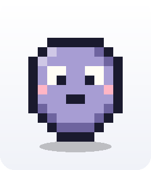
  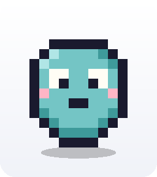
  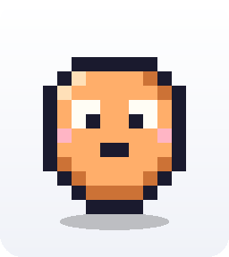
  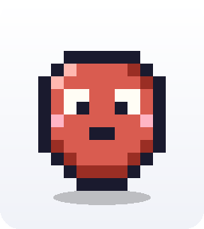
  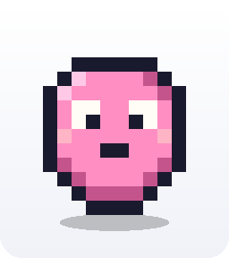
  
</p>

| form | fires when | animation |
|---|---|---|
| **Dot** | default — the one you onboarded with | gentle idle breathe |
| **Sleepy Dot** | late night, long user idle, post-lunch | slow 6s breathing, muted tint |
| **Focused Dot** | you're coding, writing, on a call | tight 2.4s pulse + cyan halo |
| **Excited Dot** | task completed, good news, a win | 0.9s bounce + coral glow |
| **Concerned Dot** | error, budget alarm, something wrong | slow 4.5s breath + red aura |
| **Playful Dot** | casual chat, banter, evenings | ±2° wiggle + pink halo |
| **Rainbow Dot** | rare — milestones only | hue-cycle every 4s |

Plus one-shot gestures: `nuzzle`, `sparkle`, `stretch`, `peek`.

### Seedling → adult

Every form has a pre-onboarding seedling variant (green leaf on top) and an adult variant.

<table>
<tr>
  <th>Dot</th><th>Sleepy</th><th>Focused</th><th>Excited</th>
</tr>
<tr>
  <td>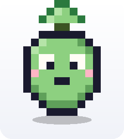<br/></td>
  <td>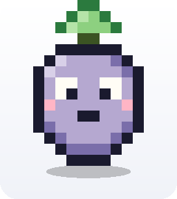<br/></td>
  <td>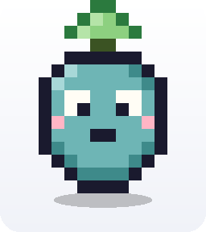<br/></td>
  <td>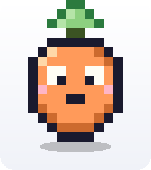<br/></td>
</tr>
<tr>
  <th>Concerned</th><th>Playful</th><th>Rainbow</th><th></th>
</tr>
<tr>
  <td>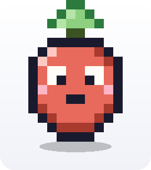<br/></td>
  <td>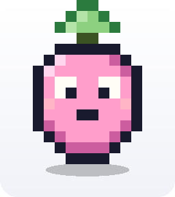<br/></td>
  <td>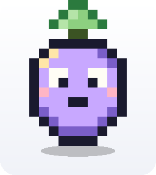<br/></td>
  <td></td>
</tr>
</table>

---

## Dot can also be *just the face*

You might already use **[openclaw](https://openclaw.ai/)** or **[nanoclaw](https://nanoclaw.dev/)**. Great — keep them. Dot can be the pixel pet sitting in front of either one.

> **Dot as pet, brains elsewhere.** Run Dot in "representative mode" and she becomes the on-screen, on-Telegram, on-launchd face of whichever backend you already trust.

```
┌──────────────┐      ┌─────────────────────┐
│   Dot (UI)   │ ◄──► │ openclaw / nanoclaw │
│  pixel pet   │      │    (your backend)    │
│  telegram    │      │   your agents, your  │
│  launchd     │      │   skills, your model │
│  memory, RL  │      │                      │
└──────────────┘      └─────────────────────┘
```

**Why people do this:**

- You already invested in openclaw's multi-channel gateway (Slack, Signal, WhatsApp, iMessage) or nanoclaw's container-isolated agent swarm. Dot doesn't ask you to throw that away.
- openclaw runs as a menubar item. nanoclaw runs headless. Neither gives you an **ambient, visible, emotional presence** on the screen. Dot does.
- Dot's memory + RL layer are designed to co-exist with an upstream brain — she can simply forward turns to your backend of choice and still learn from the outcomes (reply latency, user sentiment, `/feedback`).
- Your phone sees the same pet on Telegram. Your launchd sees the same pet in headless mode. Your screen sees the same pet in the corner.

**Three modes:**

1. **Standalone** *(default)* — Dot runs her own Claude agent end-to-end.
2. **Representative of openclaw** — Dot forwards turns to your openclaw gateway; displays and remembers; keeps the pixel presence.
3. **Representative of nanoclaw** — Dot forwards turns to a nanoclaw container; keeps memory + animations on her side.

Pick via `~/.nina/config.json`:

```jsonc
{
  "backend": "openclaw",   // or "nanoclaw", or "self"
  "backendEndpoint": "ws://127.0.0.1:18789"
}
```

Think of Dot as **the pet layer**. Animations, memory, moods, ambient presence. The agent underneath is your call.

---

## Install

```bash
# macOS 13+, Node 20+
git clone https://github.com/doramirdor/dot.git
cd dot
npm install
npm run build
./bin/launchd-install.sh install
```

That's it. She'll appear in the bottom-right corner of your main display. First boot kicks off onboarding.

### Run modes

```bash
npm run dev                                    # hot-reload development
./out/main/index.js                            # windowed (via Electron)
./out/main/index.js --headless                 # launchd daemon mode
./out/main/index.js --migrate                  # import state from openclaw/nanoclaw

./bin/launchd-install.sh status                # is it running?
./bin/launchd-install.sh tail                  # live logs
```

### Credentials

Dot reads Anthropic credentials in this order:

1. macOS Keychain (service `dot`, account `anthropic-token`)
2. `~/.openclaw/agents/main/agent/auth-profiles.json` (auto-migrated to Keychain on first read)
3. `CLAUDE_CODE_OAUTH_TOKEN` or `ANTHROPIC_API_KEY` env var

Bedrock + Vertex use their standard credential chains. Switch via:

```bash
# in Dot's input bubble
"switch to bedrock"
# or edit ~/.nina/config.json: { "provider": "bedrock" }
```

---

## What's inside (high level)

Dot is an Electron app written in TypeScript. The renderer is React. The backend is the [Claude Agent SDK](https://www.npmjs.com/package/@anthropic-ai/claude-agent-sdk) wired through a single turn primitive that every entry point (desktop, Telegram, cron, mission, proactive, ritual) funnels into.

<table>
<tr>
  <td width="50%" valign="top">

**She can learn.** Every turn is a row in a contextual-bandit replay buffer. Reward comes from observable signals (reply latency, sentiment, `/feedback`, tool outcomes) — never self-reported. A SQL `GROUP BY` is the entire learner. Policy is advisory, not executive.

**She can rewrite herself.** Four layers: `core` (code), `skills` (plugins), `brain` (memory), `heart` (personality). Every rewrite tar-snapshots first — `dot_undo <id>` restores.

**She runs untrusted code in a container.** Apple Container on macOS 15+, Docker fallback. Fails closed if no runtime is installed.

**She can fan out.** `swarm_dispatch` spawns up to 8 parallel workers, each in its own workspace, each with a fresh context.

  </td>
  <td width="50%" valign="top">

**She has multiple faces.** Seven character forms. Four gesture animations. The registry is in one file — drop a new palette + wrap class, she'll use it.

**She speaks multiple channels.** Desktop bubble, Telegram bot, future Slack/Discord — a `Channel` interface makes each one pluggable.

**She routes to multiple providers.** Anthropic, Bedrock, Vertex today. OpenAI credential storage ready for when the SDK supports it.

**She's extensible.** Drop a plugin at `~/.nina/plugins/<name>/plugin.mjs` and its tools show up on the next restart. No fork required.

**She's reversible.** Every destructive operation goes through `safe-ops.ts` → `~/.nina/trash/<ts>/` + an `undo_log` row. Disk is cheap; regrets are expensive.

  </td>
</tr>
</table>

If you want the architectural deep-dive, read [CLAUDE.md](CLAUDE.md). If you want the source tour, start at [src/core/turn.ts](src/core/turn.ts) and follow the imports.

---

## How she's different from the others

|  | Dot | ChatGPT / Claude.ai | openclaw | nanoclaw | Claude Code |
|---|---|---|---|---|---|
| On-screen visible pet | ✅ | — | — | — | — |
| Persists across sessions | ✅ | partial | ✅ | ✅ | — |
| Mobile presence | Telegram | web | 13+ channels | WhatsApp | — |
| Headless daemon | ✅ | — | ✅ | ✅ | — |
| Self-rewrites own code | ✅ | — | — | via fork | — |
| Container-isolated subprocess | ✅ | — | — | ✅ | — |
| Contextual-bandit RL | ✅ | — | — | ✅ (fork) | — |
| Reversible destructive ops | ✅ | — | — | — | — |
| Ambient mood forms | 7 | — | — | — | — |
| Can be a pet face over others | ✅ | — | — | — | — |

---

## Fixed decisions

- **Single-user.** No multi-user, no family, no collaborators.
- **Local-first voice.** Whisper locally, macOS `say` locally. Groq optional fallback.
- **Proactive push only when you're away.** Gated on screen-locked / asleep / idle ≥ 30 min.
- **Foreground never blocks.** Background jobs can be queued or capped. User chat always runs.
- **Reversibility over cleverness.** Disk is cheap; regrets are expensive.

## Credits

- RL contextual-bandit pattern — [nanoclaw](https://nanoclaw.dev/)
- Multi-channel gateway pattern — [openclaw](https://openclaw.ai/)
- [`@anthropic-ai/claude-agent-sdk`](https://www.npmjs.com/package/@anthropic-ai/claude-agent-sdk) and `claude-code` — [Anthropic](https://anthropic.com/)

## License

Private — not yet released.
